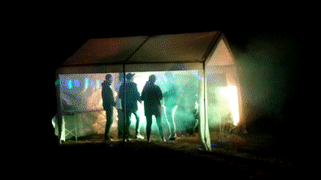

# sound-to-light-osc

Real-time detection of beats with Python from an audio input device (typically "Stereo Mix"). Outputs OSC signals,
to be used for sound-to-light control.

It keeps track of the music "intensity" (calm, normal, intense) to switch lighting programs.

I use [QLC+](https://github.com/mcallegari/qlcplus) for DMX control.

## Required modules

- PyAudio
- PyQt5
- PyQwt
- matplotlib
- scipy
- python-osc

## Usage

`python beatDetector.py`

Automatically listens to default audio input device.

## OSC Signals

OSC signals are sent to `localhost:7701`, can be changed in `beatDetector.py`.

- `/beat` is sent for every beat detected.
- `/bar` is sent every to change the lighting scene.
- `/prog1` - `/prog8` is sent to change lighting programs (available have to be configured in `beatDetector.py`)

## Acknowledgments

Based on [shunfu/python-beat-detector](https://github.com/shunfu/python-beat-detector).

## Version History

### 1.0

- Beat detection
- Automatic beat generation based on BPM
- Pause and new song detection

### 1.1

- Improved max volume calibration
- Improved pause detection
- Intensity detection
- Automatic lighting program switch
